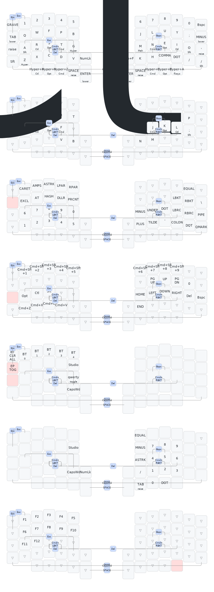

# ZMK Sofle Choc 60-Key Configuration

AI-powered ZMK keyboard configuration for the [Sofle Choc 60-key](https://keyboardhoarders.com) split ergonomic keyboard.

This repo is a standard ZMK config that also works as a **Claude Code-powered keymap editor**. Describe your key changes in plain English and Claude translates them into correct ZMK bindings.


---

## Keymap Visualization

SVG keymap diagrams are automatically generated by [keymap-drawer](https://github.com/caksoylar/keymap-drawer) whenever the keymap changes.



---

## Quick Start

```bash
# Clone the repo
git clone https://github.com/ryderdavid/zmk-soflechoc-60key.git
cd zmk-soflechoc-60key

# Launch the interactive configuration interface
# (requires Claude Code CLI: https://claude.ai/claude-code)
/zmk
```

## What `/zmk` Does

The `/zmk` command launches an interactive menu:

| Option | What It Does |
|--------|-------------|
| **View Layout** | Renders your keymap as ASCII art for every layer |
| **Map Keys** | Describe changes in plain English, get valid ZMK syntax |
| **Combos** | Add, remove, or view key combos |
| **Macros** | Create macro sequences from descriptions |
| **Layers** | Add, rename, or manage layers |
| **Build** | Compile firmware via Docker |
| **Flash** | Step-by-step flash instructions |
| **Bluetooth** | Manage BT profile bindings |
| **Settings** | Toggle `sofle.conf` options |
| **Profiles** | Save, load, and diff named keymap setups |

### Example: Map Keys

```
You: "Make holding F act as shift, tapping F stays as F"
Claude: Changes position 28 from &kp F to &mt LSHFT F
        Shows diff, asks for confirmation, writes the keymap.
```

```
You: "Put media controls on J, K, L in the raise layer"
Claude: Changes RAISE layer positions 31-33 to volume/mute controls.
```

---

## Prerequisites

| Tool | Purpose | Install |
|------|---------|---------|
| [Claude Code](https://claude.ai/claude-code) | AI-powered keymap editing | `npm install -g @anthropic-ai/claude-code` |
| [Docker](https://docs.docker.com/get-docker/) | Local firmware builds | Docker Desktop or Colima |
| Git | Version control | Pre-installed on macOS |

> **Note**: Claude Code is only needed for the AI features. You can always edit `config/sofle.keymap` manually and push to trigger GitHub Actions builds.

---

## Repo Structure

```
zmk-soflechoc-60key/
├── .claude/
│   ├── CLAUDE.md              # Board context + ZMK syntax reference
│   └── commands/
│       └── zmk.md             # The /zmk interactive command
├── docs/
│   ├── behaviors.md           # ZMK behaviors reference
│   ├── keycodes.md            # Complete keycode table
│   └── layout.md              # Physical layout + position map
├── profiles/                  # Named keymap profiles (gaming, coding, etc.)
├── config/
│   ├── sofle.keymap           # YOUR KEYMAP (the main artifact)
│   ├── sofle.conf             # Feature toggles
│   └── west.yml               # West manifest
├── boards/shields/.gitkeep    # Custom shield overlays
├── build.yaml                 # GitHub Actions build matrix
├── .github/workflows/         # CI workflow
└── README.md
```

### Example: Profiles

```
You: /zmk -> [10] Profiles -> Save current
Claude: Name? "coding"
        Description? "Home row mods, symbols on raise"
        Saved to profiles/coding.keymap

You: /zmk -> [10] Profiles -> Load profile -> "gaming"
Claude: Shows diff, backs up current keymap, loads gaming profile.
```

Profiles are git-tracked, so every layout version is in your history.

---

## Manual Editing

If you prefer editing the keymap by hand:

1. Open `config/sofle.keymap`
2. Find the layer you want to edit
3. Each layer has 60 bindings across 5 rows (12 + 12 + 12 + 14 + 10)
4. Use ZMK binding syntax (see `docs/behaviors.md` and `docs/keycodes.md`)
5. Push to trigger a GitHub Actions build, or build locally with Docker

### Key Position Reference

```
LEFT HALF                                          RIGHT HALF
,-------------------------------------------.     ,-------------------------------------------.
|  0  |  1  |  2  |  3  |  4  |  5  |           |  6  |  7  |  8  |  9  | 10  | 11  |
|-----+-----+-----+-----+-----+-----|           |-----+-----+-----+-----+-----+-----|
| 12  | 13  | 14  | 15  | 16  | 17  |           | 18  | 19  | 20  | 21  | 22  | 23  |
|-----+-----+-----+-----+-----+-----|           |-----+-----+-----+-----+-----+-----|
| 24  | 25  | 26  | 27  | 28  | 29  |           | 30  | 31  | 32  | 33  | 34  | 35  |
|-----+-----+-----+-----+-----+-----+-----.     ,-----+-----+-----+-----+-----+-----+-----|
| 36  | 37  | 38  | 39  | 40  | 41  | 42  |     | 43  | 44  | 45  | 46  | 47  | 48  | 49  |
`-----+-----+-----+-----+-----+-----+-----'     `-----+-----+-----+-----+-----+-----+-----'
            | 50  | 51  | 52  | 53  | 54  |     | 55  | 56  | 57  | 58  | 59  |
            `-----------------------------------' `-----------------------------------'
```

---

## Building Firmware

### Via GitHub Actions (Recommended)

Push any commit and GitHub Actions automatically builds firmware for:
- Left half with nice_view + Studio
- Right half with nice_view
- Left half without nice_view + Studio
- Right half without nice_view
- Settings reset

Download `.uf2` files from the Actions tab.

### Via Docker (Local)

```bash
# Start Docker (macOS with Colima)
colima start

# Use /zmk option [6] for guided builds, or run manually:
docker run --rm -v "$(pwd):/workspace" -w /workspace zmkfirmware/zmk-dev-arm:stable \
  bash -c "west init -l config && west update && west build -s zmk/app -b nice_nano@2.0.0 \
  -- -DSHIELD='sofle_left nice_view_adapter nice_view' -DZMK_CONFIG=/workspace/config \
  -DSNIPPET=studio-rpc-usb-uart"
```

---

## Flashing

1. Connect a keyboard half via USB-C
2. Double-tap the reset button on the nice!nano
3. A drive named `NICENANO` appears
4. Copy the `.uf2` file: `cp build/zephyr/zmk.uf2 /Volumes/NICENANO/`
5. Board reboots automatically
6. Repeat for the other half

---

## Links

- [ZMK Documentation](https://zmk.dev/docs)
- [ZMK Studio](https://zmk.studio) - Real-time keymap editor (when connected via USB)
- [KeyboardHoarders Store](https://keyboardhoarders.com)
- [KeyboardHoarders Blog](https://keyboardhoarders.com/blog) - Setup guides
- [ZMK Keycodes](https://zmk.dev/docs/keymaps/list-of-keycodes)
- [ZMK Behaviors](https://zmk.dev/docs/keymaps/behaviors)
